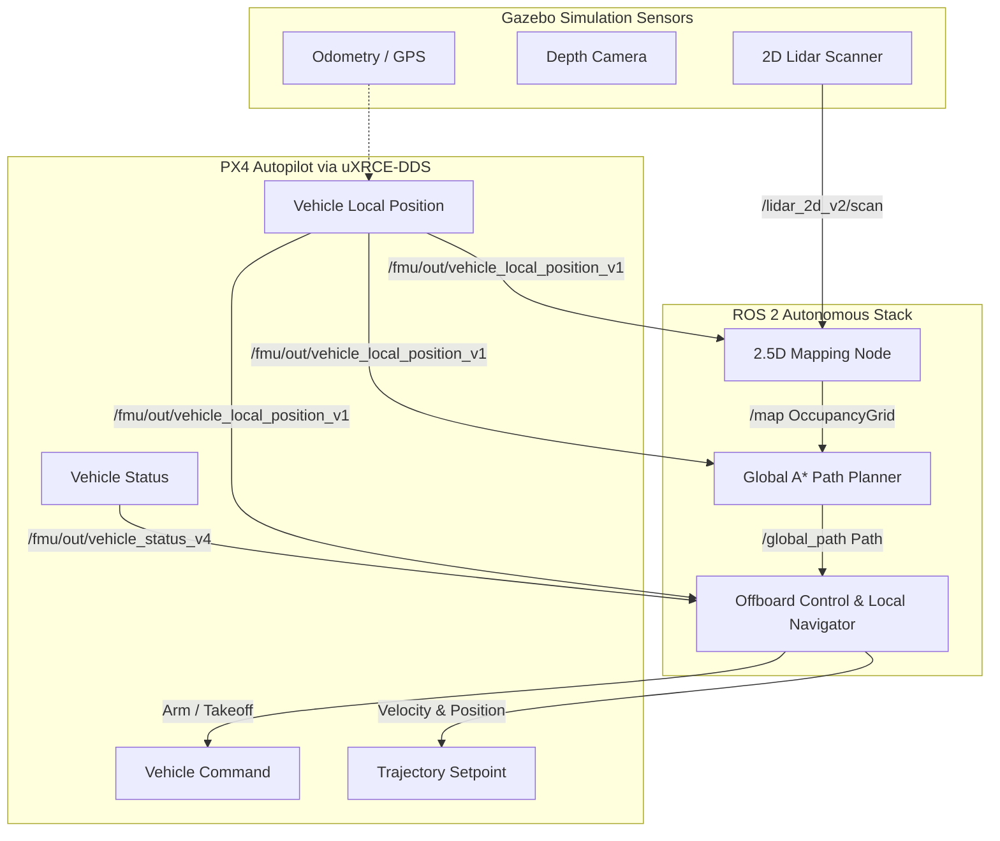
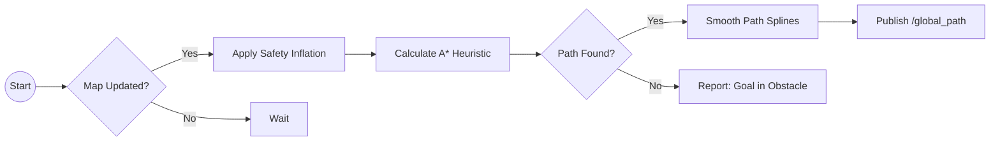

# Autonomous Drone Navigation & Obstacle Avoidance

This project implements a complete, fully autonomous drone navigation stack using **ROS 2 Humble**, **PX4 SITL (Software In The Loop)**, and **Gazebo Harmonic**. The drone is capable of taking off autonomously, building a 2.5D map of its surroundings using onboard depth and Lidar sensors, and dynamically planning and executing paths to avoid obstacles in real-time.

## Tools, Plugins & SLAM Architecture

While traditional SLAM (Simultaneous Localization and Mapping) algorithms (like Cartographer or RTAB-Map) perform both position estimation and mapping simultaneously, this autonomous system leverages a decoupled approach tailored for high-speed drone flight:

### 1. Localization (The "L" in SLAM)
- **Tool Used:** PX4 **EKF2** (Extended Kalman Filter 2)
- **How it works:** Instead of relying purely on lidar-matching for localization, the PX4 flight controller runs a highly robust EKF2 estimator. It fuses simulated GPS, IMU, and magnetometer data from Gazebo to provide high-frequency, drift-free Odometry (`/fmu/out/vehicle_local_position_v1`).

### 2. Mapping (The "M" in SLAM)
- **Tool Used:** Custom 2.5D `mapping_node.py`
- **How it works:** Since localization is perfectly handled by EKF2, our mapping node strictly focuses on spatial awareness. It takes the EKF2 localization data and pairs it with the Lidar/Depth sensor inputs using **Bresenham’s Ray-Tracing Algorithm** to dynamically populate a probabilistic Occupancy Grid (`/map`).

### 3. Gazebo & ROS 2 Plugins
This simulation heavily relies on specific bridging plugins to synchronize the physics engine with the ROS 2 network:
- **`gz-sim-sensors-system`**: Gazebo Harmonic plugin that physically renders the 2D Lidar and Depth Camera rays in the virtual world.
- **`ros_gz_bridge` (`parameter_bridge`)**: The official ROS 2 tool used to convert Gazebo's native Ignition transport messages (like `gz.msgs.LaserScan`) into standard ROS 2 `sensor_msgs/LaserScan` messages so our Python nodes can read them.
- **`MicroXRCEAgent` (uXRCE-DDS)**: The critical DDS bridging tool that translates PX4's internal uORB flight messages into ROS 2 topics, allowing our `depth_avoidance.py` node to send offboard velocity commands directly to the autopilot.

---

## Core Architecture & Workflow

The architecture is divided into three critical ROS 2 nodes: the **Mapping Node**, the **Global Path Planner**, and the **Offboard Local Controller**. Below is the high-level system architecture flowchart:



---

### 1. 2.5D Mapping Node (`mapping_node.py`)
This node acts as the eyes of the drone, translating raw sensor data into an understanding of physical space.

- **Inputs:** `/lidar_2d_v2/scan` (LaserScan), `/fmu/out/vehicle_local_position_v1` (Odometry).
- **Algorithm:** Bresenham's Line Algorithm (Ray-Tracing).
- **Workflow:** 
  1. Receives lidar distance points.
  2. Converts polar coordinates (distance, angle) into global Cartesian coordinates (X, Y) relative to the drone's position.
  3. Uses Ray-Tracing to mark all cells between the drone and the lidar hit as **Free Space**.
  4. Marks the cell at the exact location of the lidar hit as an **Obstacle** (increasing probability).
- **Output:** Publishes a standard ROS 2 `nav_msgs/OccupancyGrid` to the `/map` topic.

### 2. Global Path Planner (`path_planner.py`)
This node is responsible for finding the most efficient and safe route to the destination.

- **Inputs:** `/map` (OccupancyGrid), `/fmu/out/vehicle_local_position_v1` (Odometry), `/goal_pose` (Target Destination).
- **Algorithm:** Optimistic A* (A-Star) Search Algorithm with Safety Inflation.
- **Workflow:**
  1. Extracts the global `/map` array and identifies high-probability obstacle cells.
  2. Applies a **Costmap Inflation Radius** around obstacles, making the space near walls "expensive" to travel through. This guarantees the drone maintains a safe physical clearance.
  3. Treats completely unmapped areas as traversable but with a slight cost penalty ("Optimistic" exploration).
  4. Runs the A* heuristic search to find the mathematically shortest path.
  5. Replans dynamically at 2Hz. If a new obstacle blocks the current path, A* immediately reroutes around it.
- **Output:** Publishes a `nav_msgs/Path` to the `/global_path` topic.



### 3. Offboard Control & Local Navigator (`depth_avoidance.py`)
This is the brain of the drone that handles flight states and executes the physical movements required to follow the global path.

- **Inputs:** `/global_path` (Path), `/fmu/out/vehicle_status_v4` (Flight State), `/fmu/out/vehicle_local_position_v1` (Odometry).
- **Algorithm:** Pure-Pursuit Lookahead Controller & PX4 Offboard State Machine.
- **Workflow:**
  1. **Initialization:** Automatically sends `VehicleCommand` messages to arm the drone and transition into `OFFBOARD` flight mode.
  2. **Takeoff:** Commands a vertical ascent to the configured hover altitude (e.g., 2.0 meters) before accepting any horizontal movement commands.
  3. **Local Navigation (Path Following):** 
     - Extracts the `nav_msgs/Path` provided by the Global Planner.
     - Projects a "lookahead" point slightly ahead of the drone on the path (Pure-Pursuit).
     - Calculates a proportional velocity vector pointing toward that lookahead target.
     - Commands the drone using `TrajectorySetpoint` messages containing XY velocity and Z position constraints.
- **Output:** Publishes `/fmu/in/trajectory_setpoint`, `/fmu/in/vehicle_command`, and `/fmu/in/offboard_control_mode`.

---

## Setup & Launch Instructions

### Prerequisites
Before launching this project, ensure you have installed the following:
- **ROS 2 Humble**
- **PX4-Autopilot** (SITL setup)
- **Gazebo Harmonic**
- **MicroXRCEAgent** (uXRCE-DDS)
- **colcon** build tools


### 1. Build the Workspace
Before running the simulation, build the ROS 2 workspace. Open a new terminal and run:
```bash
cd ~/Downloads/Mokshagn_px4/drone_avoidance_ws
source /opt/ros/humble/setup.bash
colcon build
```

*(Note: If you receive a `not found: install/local_setup.bash` error, it means you have not successfully run `colcon build` in the `drone_avoidance_ws` folder yet! Ensure you are in the correct directory before building).*

### 2. Launch the Simulation
Open a fresh terminal, source your workspace, and run the unified launch file. This single command boots Gazebo, PX4 SITL, the DDS bridge, and all 3 navigation nodes automatically:

```bash
cd ~/Downloads/Mokshagn_px4/drone_avoidance_ws
source install/setup.bash
export ROS_DOMAIN_ID=42
export GZ_PARTITION=barkath_drone
ros2 launch obstacle_avoidance drone.launch.py
```

### 3. Command the Drone
Once the drone has armed, taken off, and is hovering, open a second terminal to send a goal destination. 

*(Example: Flying to X=53 in the newly expanded corridor map)*
```bash
export ROS_DOMAIN_ID=42
ros2 topic pub --once /goal_pose geometry_msgs/msg/PoseStamped "{header: {frame_id: 'map'}, pose: {position: {x: 53.0, y: 0.0, z: 2.0}}}"
```

You can monitor the real-time ray-tracing, map generation, and A* path planning in the RViz2 window that opens automatically alongside Gazebo!
